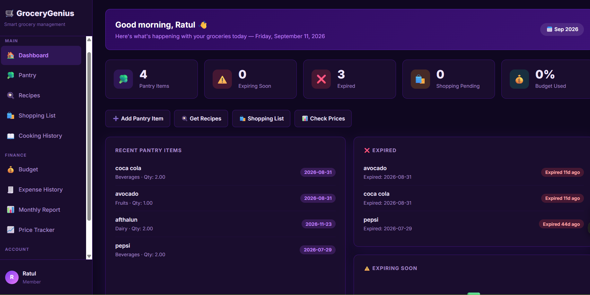
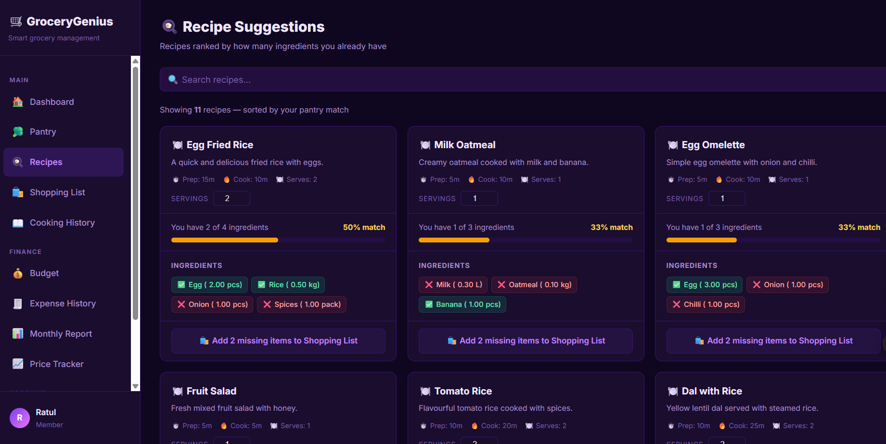
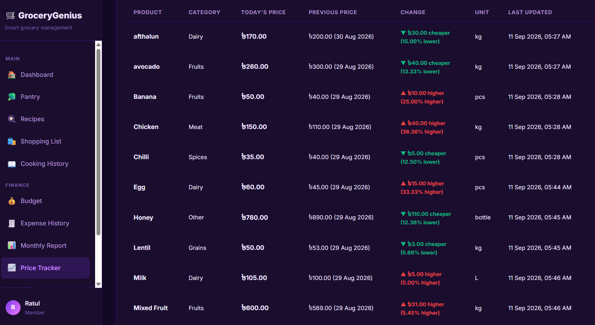
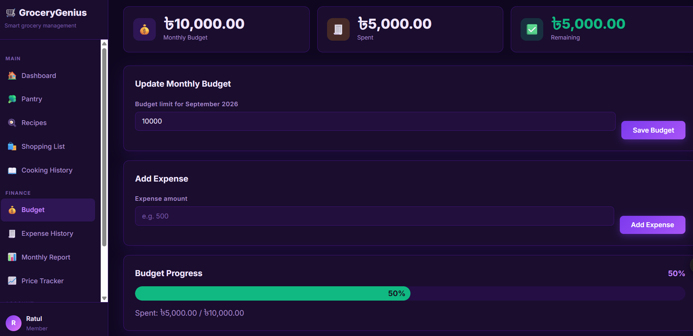
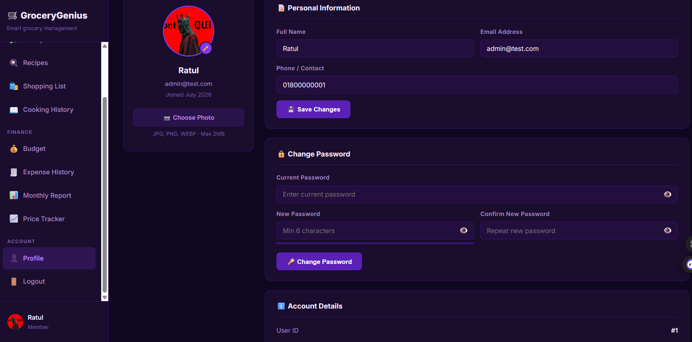
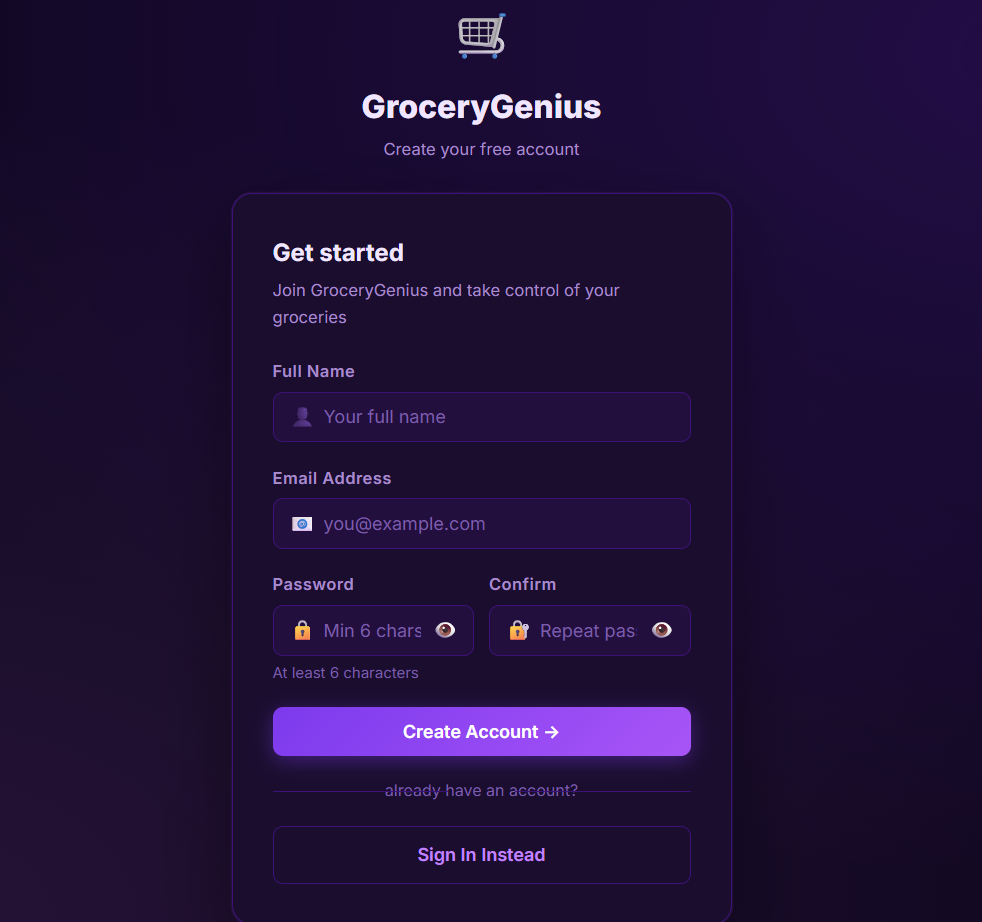

# GroceryGenius 🛒

A smart grocery management and meal planning web application built for everyday Bangladeshi households.


-D22128?logo=apache&logoColor=white)


[](https://grocerygenius.infinityfree.io/)

**🔗 Live Demo:** [grocerygenius.infinityfree.io](https://grocerygenius.infinityfree.io/) &nbsp;·&nbsp; **📦 Repo:** [github.com/Ratul-007/GroceryGenius](https://github.com/Ratul-007/GroceryGenius)

---

## 📑 Table of Contents

- [Features](#-features)
- [Screenshots](#-screenshots)
- [Team](#-team--404-team-not-found)
- [Tech Stack](#️-tech-stack)
- [Installation](#️-installation)
- [Project Structure](#-project-structure)
- [Core Loop](#-core-loop)
- [Database Tables](#️-database-tables)
- [Future Scope](#-future-scope)
- [License](#-license)
- [Support](#-support)

---

## 🌟 Features

- **Dashboard** — Live overview of pantry status, expiry alerts, budget usage, and recipes cooked this month
- **Pantry Manager** — Track grocery items, quantities, and expiry dates with automatic expired/expiring-soon alerts
- **Cook Mode** — Step-by-step cooking guide with serving size adjuster and automatic ingredient deduction on completion
- **Cooking History** — Full log of every recipe cooked with date, time, and stats
- **Shopping List** — Add items, mark as purchased, and auto-deduct from monthly budget
- **Budget Tracker** — Monitor grocery spending with colour-coded progress bar and audio alerts (amber warning + red air horn)
- **Expense History** — Day-by-day breakdown of all grocery purchases with monthly filter
- **Monthly Report** — Full monthly summary including daily spending chart, top products, category breakdown, and recipes cooked
- **Price Tracker** — Record and compare daily grocery prices with 7-day trend charts and yesterday comparison
- **Profile Page** — Update name, contact, profile photo, and change password

---

## 📸 Screenshots

<table>
  <tr>
    <td align="center" width="50%">
      
      <br><b>Dashboard</b> — pantry, expiry & budget at a glance
    </td>
    <td align="center" width="50%">
      
      <br><b>Recipe Suggestions</b> — ranked by pantry match %
    </td>
  </tr>
  <tr>
    <td align="center" width="50%">
      
      <br><b>Price Tracker</b> — daily price changes by product
    </td>
    <td align="center" width="50%">
      
      <br><b>Budget Tracker</b> — monthly limit & spend progress
    </td>
  </tr>
  <tr>
    <td align="center" width="50%">
      
      <br><b>Profile</b> — account & password management
    </td>
    <td align="center" width="50%">
      
      <br><b>Sign Up</b> — create a free account
    </td>
  </tr>
</table>

---

## 👥 Team — 404 Team Not Found

| Name | Role |
|------|------|
| Ratul | Backend Developer (Team Leader) |
| Arnab | Frontend Developer |
| Prabak | UI/UX Designer |

---

## 🛠️ Tech Stack

| Layer | Technology |
|-------|-----------|
| Frontend | HTML5, CSS3, JavaScript (Web Audio API) |
| Backend | PHP 8 |
| Database | MySQL (MariaDB 10.4) |
| Server | Apache (XAMPP) |

---

## ⚙️ Installation

1. **Clone the repository**
   ```bash
   git clone https://github.com/Ratul-007/GroceryGenius.git
   ```

2. **Move to XAMPP's htdocs folder**
   ```bash
   # Windows
   move GroceryGenius C:\xampp\htdocs\GroceryGenius
   ```

3. **Import the database**
   - Start Apache and MySQL from XAMPP Control Panel
   - Open `http://localhost/phpmyadmin`
   - Create a new database named `grocerygenius_db`
   - Import `sql/grocerygenius.sql`

4. **Configure database connection**
   - Open `config/db.php`
   - Set your MySQL host, username, and password

5. **Run the app**
   - Visit `http://localhost/GroceryGenius/index.php`

---

## 📁 Project Structure

```
GroceryGenius/
├── assets/
│   ├── css/                # Global stylesheet (dark purple theme)
│   ├── screenshots/        # README screenshots
│   └── uploads/avatars/    # User profile photos
├── config/
│   └── db.php              # Database connection
├── pages/                  # All PHP pages
│   ├── dashboard.php       # Home overview
│   ├── pantry.php          # Pantry management
│   ├── recipes.php         # Recipe suggestions + favorites
│   ├── cook.php            # Step-by-step cook mode
│   ├── cooking_history.php # Cooking log
│   ├── shopping.php        # Shopping list
│   ├── budget.php          # Budget tracker
│   ├── expense_history.php # Purchase history
│   ├── monthly_report.php  # Monthly summary report
│   ├── prices.php          # Price tracker
│   ├── profile.php         # User profile
│   ├── login.php           # Login
│   ├── register.php        # Registration
│   └── logout.php          # Logout
├── sql/                    # SQL scripts
└── index.php               # Entry point (redirects to login/dashboard)
```

---

## 🔄 Core Loop

```
Add to Shopping List
       ↓
Mark as Purchased → Budget Auto-Deducted
       ↓
Recipe Match 100%
       ↓
Cook Mode (serving size adjustable)
       ↓
Finish Cooking → Ingredients Deducted
       ↓
Recipe resets to 0% → Loop continues 🔄
```

---

## 🗄️ Database Tables

| Table | Purpose |
|-------|---------|
| `users` | User accounts |
| `products` | Product catalogue |
| `pantry_items` | User pantry stock |
| `recipes` | Recipe definitions |
| `recipe_ingredients` | Recipe ingredient mappings |
| `recipe_favorites` | Bookmarked recipes per user |
| `shopping_list` | Active shopping items |
| `purchase_history` | Permanent purchase records |
| `cooking_history` | Cooking session log |
| `budget` | Monthly budget limits and spending |
| `grocery_prices` | Current tracked prices |
| `price_history` | Historical price records |

---

## 🔮 Future Scope

- **Automated Price Updates** — Integration with TCB (Trading Corporation of Bangladesh) daily commodity price data
- **AI Recipe Recommendations** — Smarter suggestions using machine learning based on pantry contents and preferences
- **Multi-user Household** — Share pantry and shopping lists across family members
- **Barcode Scanner** — Scan product barcodes to add items to pantry instantly

---

## 📄 License

This project was developed as an academic project for the Software Engineering course at Chittagong Independent University (Summer 2026).

---

## ⭐ Support

If you found this project useful:

⭐ Star the repository &nbsp;·&nbsp; 🍴 Fork it &nbsp;·&nbsp; 📢 Share it with others